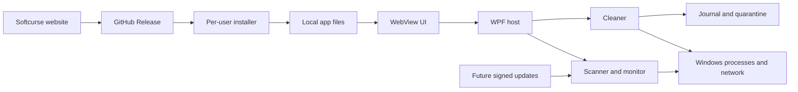

# Softcurse Blackwatch v0.1.0 Early Alpha Threat Model

## Executive summary

Blackwatch v0.1.0 Early Alpha is a local, single-user Windows monitoring application for home users, distributed as a GitHub Release reached through the Softcurse website. It has no Softcurse backend, accounts, telemetry upload, privileged service, runtime IPC, organization features, or in-app updater. The highest current risks are same-user WebUI integrity, recovery commands, mutable local journals/configuration, and an unsigned release/download chain. The app now runs as the invoking user and loads only bundled UI resources under a restrictive content policy. The signed rule/reputation loaders are dormant foundations for a separately designed future organizational/updater version and are not a current runtime boundary.

## Scope and assumptions

- In scope: `Softcurse.UI`, `Frontend`, `Softcurse.Core`, `Softcurse.Monitor`, `Softcurse.Cleaner`, `Softcurse.Shared`, `SoftcurseBlackwatch.iss`, solution/build metadata, and the intended GitHub Release/Softcurse website distribution path.
- Runtime model: one interactive Windows desktop process, one signed-in home user, no service and no Softcurse server. Monitoring ends when the application exits.
- Distribution model: unsigned installers are published in GitHub Releases and linked from `https://softcursesystems.pages.dev/lab/blackwatch`; the Early Alpha performs no in-app update checks.
- Data sensitivity: local process names, executable paths and hashes, command lines, network endpoints/hostnames, configuration, response journals, quarantine contents, and logs.
- Attacker model includes an untrusted webpage/resource supplier, release-channel attacker, and malware already executing as the same non-administrator user. Physical attacks, a compromised Windows kernel/administrator account, WebView2 engine vulnerabilities, GitHub/Cloudflare internal compromise, and future server APIs are out of scope.
- Organization management, a Softcurse backend, and an in-app updater are future-version concepts and explicitly out of scope for the Early Alpha.
- The public website and repository URLs could not be independently fetched during this review; distribution details above are user-confirmed. The provided GitHub URL returned 404 to the browsing client and may be private or not yet published.

The Early Alpha is intentionally unsigned, so the release page and website must clearly identify the expected Windows SmartScreen warning and publish SHA-256 checksums. Rule/reputation delivery belongs to the future updater threat model, not this release.

## System model

### Primary components

- WPF/WebView2 shell: hosts the React bundle, exports monitoring data, validates bridge origin and command schema, and collects native consent (`Softcurse.UI/MainWindow.xaml.cs`, `OnWebMessageReceived`).
- React UI: renders local data and submits typed bridge requests (`Frontend/src/bridge.ts`).
- Scanner and detection engine: enumerates processes, enriches file identity and applies versioned rules (`Softcurse.Core/Scanning/ProcessScanner.cs`, `Softcurse.Core/Detection/ThreatScorer.cs`).
- Monitor: samples system/network state and performs reverse DNS (`Softcurse.Monitor/NetworkMonitor.cs`, `Softcurse.Monitor/ReverseDnsCache.cs`).
- Cleaner: owns live process termination, autorun mutation, quarantine/restore and recovery (`Softcurse.Cleaner/BlackwatchCleaner.cs`).
- Local state: configuration, logs, JSONL action journal, quarantine files and manifests under local application data (`Softcurse.Shared/Config/BlackwatchConfig.cs`, `Softcurse.Cleaner/ActionJournal.cs`).
- Distribution: per-user Inno Setup package downloaded from GitHub Releases through a website link (`SoftcurseBlackwatch.iss`).

### Data flows and trust boundaries

- Local WebUI files → WebView2: HTML/JS/CSS/images cross a filesystem-to-browser boundary through `https://blackwatch.local`; top-level navigation is host-restricted, CORS is denied, external resources are blocked by CSP, and the app runs without elevation. The mapped files remain user-writable and no runtime content digest is checked.
- WebView2 → WPF host: versioned JSON commands cross `postMessage`; source scheme/host and command fields are checked, but there is no rate limit and recovery/configuration commands do not receive native consent.
- WPF host → WebView2: process, threat, network, log and recovery data cross through generated JavaScript; JSON is escaped before string interpolation, but this remains a code-generation boundary rather than direct JSON transport.
- Windows APIs/filesystem → scanner/monitor: process metadata, WMI, TCP/UDP tables, executable files and DNS data are read with the app token; errors are often degraded or suppressed.
- WPF → cleaner → Windows: live process and filesystem/registry mutations cross the operating-system boundary; process kills have native consent, single-use authorization, identity revalidation, protected-process policy and journaling. Restore/autorun/quarantine do not yet share the complete authorization policy.
- Cleaner ↔ local state: journal/manifests/configuration/quarantine are plain local files; hashes protect quarantined content consistency but there is no keyed integrity protection or restrictive ACL setup.
- Website → GitHub Release → user: the user trusts a website link and downloaded installer; no repository evidence shows Authenticode signing, published checksums, provenance, or automated release verification.
- Future update bundle → signed loaders: dormant code provides detached RSA-PSS/SHA-256 signatures, version rollback checks and validity windows, but the Early Alpha has no download client, production key or activation path. This becomes a boundary only in a future updater/organization version.

#### Diagram

## Assets and security objectives

| Asset | Why it matters | Security objective (C/I/A) |
|---|---|---|
| Process-response authority | Misuse can terminate applications and lose user work | I/A |
| Quarantined files and restore paths | Tampering can destroy evidence or restore content to the wrong location | I/A |
| Detection rules and reputation data | Integrity determines alert accuracy and response targeting | I/A |
| Allowlist and configuration | Tampering can suppress detections or silently enable live mode | I/A |
| Action journal and recovery records | Required for trustworthy audit and safe crash recovery | I/A |
| Process/network/log data | Reveals installed software, paths, command lines and remote services | C/I |
| Installer and application binaries | Compromise yields code execution under user or elevated context | I/A |
| Brand/download link | Users rely on it to obtain the authentic installer | I/A |

## Attacker model

### Capabilities

- Run malware as the same ordinary Windows user, edit files writable by that user, send UI input and race local process state.
- Control a dependency/CDN response or lure a user to a substituted download page/release asset.
- Supply malformed local configuration, journal, manifest, rule, reputation or frontend files after gaining the corresponding filesystem access.
- Create process names, paths, command lines and network behavior intended to evade or poison heuristic classification.

### Non-capabilities

- No assumed administrator, SYSTEM, kernel, physical-machine or GitHub/Cloudflare operator access.
- No remote application API, listening port, account session or multi-tenant data boundary exists in the Early Alpha.
- No assumption that an image-only remote resource can directly execute script; its current risks are request metadata leakage, availability and future content-policy drift.

## Entry points and attack surfaces

| Surface | How reached | Trust boundary | Notes | Evidence (repo path / symbol) |
|---|---|---|---|---|
| WebView bundle | User-writable installed files | Filesystem → browser → host | Virtual-host origin alone does not authenticate bundle bytes | `SoftcurseBlackwatch.iss`; `Softcurse.UI/MainWindow.xaml.cs` / `SetVirtualHostNameToFolderMapping` |
| WebView bridge | `chrome.webview.postMessage` | Browser → WPF | Origin/version/action checks; no rate limit; uneven consent | `Frontend/src/bridge.ts`; `Softcurse.UI/MainWindow.xaml.cs` / `OnWebMessageReceived` |
| Recovery actions | Settings UI bridge messages | Browser → cleaner/filesystem | Restore/finalize/dismiss are directly dispatchable | `Softcurse.UI/MainWindow.xaml.cs`; `MainViewModel.ExecuteRecoveryAction` |
| Configuration/allowlist | Local JSON and bridge commands | User/filesystem → detector | Atomic saves and validation exist; entries are process-name only | `Softcurse.Shared/Config/BlackwatchConfig.cs`; `ThreatScorer.IsWhitelisted` |
| Quarantine/journal | Local files and recovery UI | Cleaner ↔ filesystem | Write-ahead records and SHA-256 manifests; no MAC/ACL hardening | `Softcurse.Cleaner/ActionJournal.cs`; `BlackwatchCleaner.RestoreFromQuarantine` |
| Executable enrichment | Process paths and Authenticode metadata | OS/filesystem → detector | Hash/signature failures degrade to incomplete evidence | `Softcurse.Core/Scanning/ProcessScanner.cs` |
| DNS/network inspection | Local connection tables and external DNS | OS/network → monitor | Generates outbound resolver traffic; reputation is optional | `Softcurse.Monitor/NetworkMonitor.cs`; `ReverseDnsCache.cs` |
| Remote UI images | HTTPS image requests | WebView → third-party CDN | Unnecessary outbound requests from a local security tool | `Frontend/src/components/CircuitBackground.tsx` |
| Installer/download | Website link and GitHub asset | Internet → user → Windows | No evidence of signature/checksum/provenance verification | `SoftcurseBlackwatch.iss`; user-confirmed release flow |
| Future rule bundles | Local payload/signature inputs | Update source → detector | Strong verification primitives exist but are not activated | `SignedRuleSetLoader.Load`; `SignedReputationSetLoader.Load` |

## Top abuse paths

1. Local malware modifies the user-writable WebUI bundle → user launches Blackwatch as the same user → malicious same-origin UI exercises bridge operations → recovery/configuration state is manipulated and repeated consent prompts can be generated, without crossing an elevation boundary.
2. Attacker replaces the website download link or GitHub asset → user runs an unsigned lookalike installer → arbitrary code executes under the trusted Blackwatch brand.
3. Compromised WebUI sends `recovery/restore` for a visible action ID → the host displays a native target-specific dialog → without user consent no capability is issued and the cleaner rejects the operation; residual risk is consent-prompt deception rather than silent restore.
4. Same-user malware edits trusted-application configuration → unless it supplies a valid canonical path and SHA-256 plus the recorded publisher when present, the exception does not match → residual risk depends on local configuration-file integrity rather than process-name spoofing.
5. Same-user malware attempts to edit journal/manifest state → ACLs and the chained record digest expose ordinary or cross-user tampering → malware already running as the same user could still recompute an unkeyed chain, so audit integrity is evidentiary rather than a security boundary.
6. A forged or rolled-back future rules feed is introduced → if activation omits durable version state or uses a replaceable public key, detection weights/indicators are weakened → malicious activity is missed or benign processes are targeted.
7. Third-party UI image requests expose launch-time IP/referrer/cache metadata or fail → privacy and UI availability depend on an unrelated CDN despite local copies being present.
8. Bridge messages or scans are flooded → target-scoped cooldowns reject repeated scans and consent prompts → residual UI serialization/low-cost navigation flooding remains but cannot continuously open live-action dialogs.

## Threat model table

| Threat ID | Threat source | Prerequisites | Threat action | Impact | Impacted assets | Existing controls (evidence) | Gaps | Recommended mitigations | Detection ideas | Likelihood | Impact severity | Priority |
|---|---|---|---|---|---|---|---|---|---|---|---|---|
| TM-001 | Same-user malware | Ability to modify per-user installation files and the compiled application independently before launch | Replace WebUI content while also bypassing its embedded manifest verification | Trusted UI and local security-state compromise | Installer, process-response authority, configuration | `asInvoker`, restrictive CSP, origin checks, no unsafe blocks, plus exact-set SHA-256 manifest embedded in the compiled assembly and verified before WebView initialization (`app.manifest`, `Softcurse.UI.csproj`, `WebUiIntegrityVerifier`, `MainWindow_Loaded`) | SHA-256 authenticates the UI only relative to the executable; unsigned executable replacement remains part of TM-003 | Authenticode-sign binaries/installer and verify release provenance; retain fail-closed integrity tests | Log integrity failures before refusing UI initialization | Low: requires replacing both protected expectations and content, or the entire unsigned app | Medium | low pending release signing |
| TM-002 | Compromised same-origin UI | WebUI compromise or local UI tampering plus successful user deception | Repeatedly request restore/finalize/dismiss and trick the user into approving the native dialog | Restore malicious content or alter recovery audit state | Quarantine, journal, user filesystem | Native target details and consent; 30-second, operation/action-ID-bound, single-use capability; restore manifest/hash verification and overwrite refusal (`MainWindow.ShowRecoveryConfirm`, `AuthorizeRecovery`, `RestoreRecovery`) | A compromised UI can still generate consent prompts; rejected attempts are logged but not rate-limited | Add per-action prompt cooldown and disable duplicate pending requests; consider trusted UI bundle verification | Alert on rejected/repeated recovery requests | Low | High | medium |
| TM-003 | Release-channel attacker | Website/GitHub link or asset substitution; user trusts branding | Deliver modified installer/binaries | Arbitrary code execution and durable brand compromise | Installer, application, user data | HTTPS hosting is expected | No Authenticode, checksum, provenance or reproducible release gate evidenced | Authenticode-sign installer and binaries; publish SHA-256 and GitHub artifact attestations; website link to pinned release asset/API metadata; document verification | Monitor website link changes; verify release asset digest in CI | Medium | High | high |
| TM-004 | Same-user malware | Write access to local app-data configuration | Insert or modify a trusted executable record or alter safety settings | Detection evasion and unsafe response posture | Rules, trusted identities, configuration | Active exceptions require canonical path + SHA-256 and optional publisher match; native file selection/identity confirmation; legacy names are inactive; atomic config write and validation (`TrustedApplicationIdentity`, `ThreatScorer.IsTrusted`, `BlackwatchConfig`) | Configuration itself has no keyed integrity or restrictive ACL setup | Add configuration ACL hardening and an integrity/audit chain; journal old/new trust identities and safety-setting changes | Alert on config changes outside the app; log trust identity deltas | Medium | Medium | medium |
| TM-005 | Same-user malware | Same-user execution or replacement of protected local state | Recompute an unkeyed journal chain or alter quarantine metadata and content together | Misleading recovery, lost evidence, unsafe restore decisions | Journal, quarantine | Current-user/LocalSystem-only explicit ACLs; versioned SHA-256 record chain; legacy-prefix commitment; truncation repair; mid-file/valid-JSON tamper rejection; quarantine content hashes (`ProtectedLocalStorage`, `ActionJournal.ReadAndVerify`) | ACLs do not isolate malware running as the same user; chain is not keyed; manifest and journal are not mutually bound | Protect a journal authentication key with Windows DPAPI in a future hardening pass; bind quarantine manifest digest into terminal journal records; back up terminal records | Log integrity failures and expose a fail-closed degraded state prominently | Low to Medium | Medium | medium |
| TM-006 | Third-party CDN/operator or network observer | A future UI change reintroduces external resources | Observe/fail remote requests or supply unwanted content | Privacy leakage and degraded UI | User network metadata, availability | All images are bundled, CSP limits resources to self with `connect-src 'none'`, and tests reject remote runtime URLs/network clients (`CircuitBackground.tsx`, `Frontend/index.html`, `runtime-policy.test.ts`) | A WebView engine-level request audit is not yet present | Keep the regression test mandatory and add a WebView resource-request audit to desktop smoke tests | Log unexpected WebView resource requests | Low | Low | low |
| TM-007 | Future feed attacker or compromised signing workflow | In-app update activation is added | Supply rollback, forged feed, or malicious signed rules | False negatives, false positives and unsafe response targeting | Detection/reputation integrity | RSA-PSS/SHA-256, expiry/validity checks, rollback parameter (`SignedRuleSetLoader`, `SignedReputationSetLoader`) | No production key pin, durable minimum version, download/atomic activation or key rotation design | Embed pinned offline root; signed delegated keys; persist highest accepted version; atomic staged activation; fail to last-known-good; separate rules from executable updates | Record feed digest/version/source and rollback rejections | Low now; Medium once remote updates exist | High | medium now, high when activated |
| TM-008 | Malicious local process/user-controlled metadata | Process names, paths, endpoints and messages enter logs/UI | Inject misleading control characters or sensitive values into logs | Analyst confusion and local privacy exposure | Logs, diagnostics, process/network data | Structured in-memory models and JSON serialization | Plain text logs, silent write failures, no retention/ACL/redaction policy | Escape CR/LF/control characters; cap fields; define retention; restrict ACL; never log command lines/tokens by default | Count dropped/sanitized fields and file-write failures | Medium | Low | low |
| TM-009 | Same-origin UI or local automation | Ability to send many bridge requests | Flood scans, confirmation dialogs, navigation or state pushes | CPU/memory exhaustion and unusable UI | Availability, user trust | Scan semaphore plus target-scoped cooldowns for scans, action prompts, trusted-file picker and safety-mode changes; live-mode transition requires native confirmation (`CommandRateLimiter`, `MainWindow.RateLimitFor`, `ShowDryRunChange`) | Navigation/window commands and periodic host-to-WebView serialization are not bounded by the same queue | Replace async dispatcher timers with cancellable periodic loops, bound UI update queues, and coalesce navigation/state pushes | Keep rate-limit rejection counters and surface sustained abuse | Low to Medium | Medium | medium |

## Criticality calibration

- Critical: practical compromise crosses a privilege boundary or turns the trusted installer/app into arbitrary code execution. Examples: reintroducing an elevated user-writable WebView host; a broadly distributed malicious installer under the Blackwatch identity.
- High: compromises core response or detection integrity with plausible home-user prerequisites. Examples: unauthorized quarantine restore; persistent allowlist evasion; signed-update key compromise after updates are activated.
- Medium: materially degrades audit integrity, privacy or availability without direct code execution. Examples: journal tampering, bridge flooding, rollback attempts blocked only by caller-supplied state.
- Low: limited local disclosure or deception with straightforward containment. Examples: control-character log injection; launch-time third-party image metadata leakage in isolation.

## Focus paths for security review

| Path | Why it matters | Related Threat IDs |
|---|---|---|
| `Softcurse.UI/app.manifest` | Defines the current elevation boundary and contradicts per-user least privilege | TM-001 |
| `Softcurse.UI/MainWindow.xaml.cs` | Owns WebView policy, data injection, origin validation and all bridge routing | TM-001, TM-002, TM-009 |
| `Frontend/src/bridge.ts` | Defines commands available to same-origin web content | TM-002, TM-009 |
| `Frontend/src/components/CircuitBackground.tsx` | Contains unnecessary third-party runtime resources | TM-006 |
| `Softcurse.UI/ViewModels/MainViewModel.cs` | Converts bridge/UI intent into cleaner operations and configuration changes | TM-002, TM-004, TM-009 |
| `Softcurse.Cleaner/BlackwatchCleaner.cs` | Sole owner of process/filesystem/registry mutations and recovery | TM-001, TM-002, TM-005 |
| `Softcurse.Cleaner/MutationAuthorizationService.cs` | Implements live-action capability lifetime, target binding and replay control | TM-001, TM-002 |
| `Softcurse.Cleaner/ActionJournal.cs` | Defines audit durability and corruption behavior | TM-005 |
| `Softcurse.Cleaner/ActionRecoveryReconciler.cs` | Decides which interrupted mutations can be finalized safely | TM-002, TM-005 |
| `Softcurse.Shared/Config/BlackwatchConfig.cs` | Stores allowlist and safety posture in user-writable JSON | TM-004 |
| `Softcurse.Core/Detection/ThreatScorer.cs` | Applies the name-only allowlist and detection evidence | TM-004, TM-007 |
| `Softcurse.Core/Detection/SignedRuleSetLoader.cs` | Future rules supply-chain verification boundary | TM-007 |
| `Softcurse.Monitor/SignedReputationSetLoader.cs` | Future reputation supply-chain verification boundary | TM-007 |
| `Softcurse.Shared/Logging/BlackwatchLogger.cs` | Persists potentially sensitive attacker-influenced metadata | TM-008 |
| `SoftcurseBlackwatch.iss` | Defines install scope, writable location and shipped artifact set | TM-001, TM-003 |
| `Frontend/package-lock.json` | Pins a large frontend dependency/build supply chain | TM-003 |

## Quality check

- [x] Covered discovered runtime entry points: WebView files/messages, configuration, filesystem/process/network inspection, cleaner/recovery, logs, quarantine and installer.
- [x] Covered every identified trust boundary in at least one threat.
- [x] Separated current runtime behavior from distribution/build concerns and the future update system.
- [x] Reflected user clarification: the Early Alpha is local-only, single-user/home-user software with no Softcurse server.
- [x] Explicitly recorded distribution assumptions and public-URL verification limitations.
